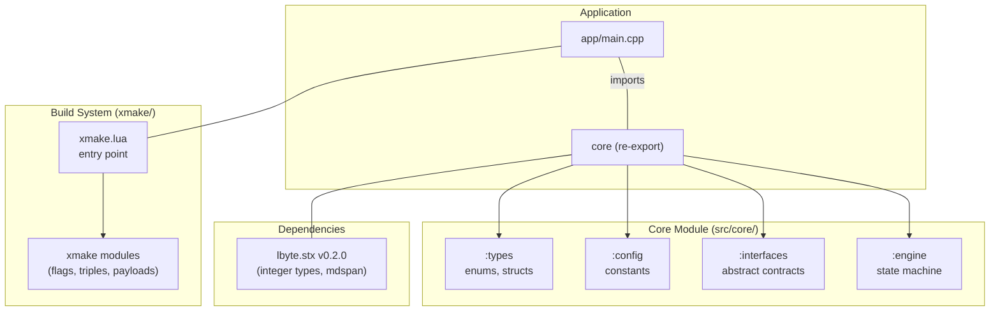
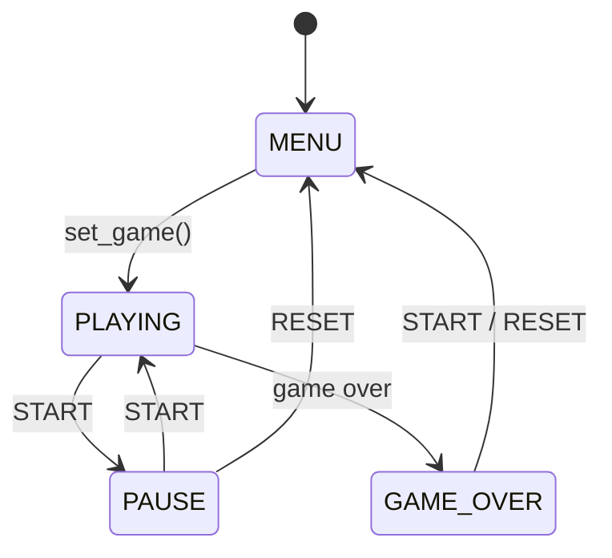

# Bricker

**Bricker** is a modern, modular reimplementation of the classic *Brick Game 9999-in-1* handheld consoles -- those ubiquitous yellow-and-black "Tetris" devices from the 1990s -- written in **C++23** with **named modules**, built with **xmake**, and designed from the ground up for extensibility.

> **Status:** Initial release -- core engine, abstract interfaces, type system, and build infrastructure.

---

## Table of Contents

- [Features](#features)
- [Architecture](#architecture)
- [Project Structure](#project-structure)
- [Dependencies](#dependencies)
- [Quick Start](#quick-start)
- [Build Options](#build-options)
- [Roadmap](#roadmap)
- [Documentation](#documentation)
- [License](#license)

---

## Features

| Area                        | Description                                                                                              |
|-----------------------------|----------------------------------------------------------------------------------------------------------|
| **C++23 Modules**           | All source code uses C++20/23 named modules (`.cppm`); no legacy headers.                                |
| **Plugin Architecture**     | Games implement an abstract `game_engine` interface -- add new games without modifying the core.         |
| **Deterministic Engine**    | Tick-based state machine with configurable speed (1-10) and level (1-10), central `engine` orchestrator. |
| **10x20 Pixel Grid**        | Flat pixel buffer exposed as `std::mdspan<u8, 20, 10>` -- zero-cost 2D access with const-correct views.  |
| **Abstract Sound Contract** | `sound_controller` interface with `null_sound_player` default -- swap in any audio backend.              |
| **xmake Build System**      | Custom Lua modules for compiler flag management, target triple detection, and compile commands.          |
| **No RTTI / No Exceptions** | Release builds use `-fno-exceptions -fno-rtti` for minimal, hardened binaries.                           |

---

## Architecture



| Layer     | Component         | Responsibility                                                 |
|-----------|-------------------|----------------------------------------------------------------|
| **Entry** | `app/main.cpp`    | Minimal `main()` stub; imports `lbyte.stx`.                    |
| **Core**  | `core:types`      | Enums (`system_state`, `button`, `game_id`), structs (`note`). |
| **Core**  | `core:config`     | Grid dimensions (10x20), speed/level caps, tick timing.        |
| **Core**  | `core:interfaces` | `game_engine`, `sound_controller`, `game_buffer` typedefs.     |
| **Core**  | `core:engine`     | State machine orchestrator, owns active game and buffer.       |

### Engine State Machine



---

## Project Structure

```sh
.
|-- LICENSE                         # MIT License
|-- README.md                       # This file
|-- xmake.lua                       # xmake build entry point
|-- .gitignore                      # Ignored: build/, .xmake/, src/games/*, app/tui.cpp
|
|-- app/
|   +-- main.cpp                    # Application entry point (C++23, imports lbyte.stx)
|
|-- src/
|   +-- core/
|       |-- core.cppm               # Primary module -- re-exports all partitions
|       |-- config.cppm             # Game constants (grid, speed, tick)
|       |-- engine.cppm             # State machine orchestrator
|       |-- interfaces.cppm         # Abstract contracts (game_engine, sound_controller)
|       +-- types.cppm              # Enums and data structures
|
|-- xmake/
|   +-- packages/
|       +-- l/lbyte.stx/
|           +-- xmake.lua           # Local package recipe for lbyte.stx
|
+-- docs/
    |-- architecture.md             # C4 architecture documentation
    +-- core.md                     # Core module reference
```

---

## Dependencies

| Dependency    | Version     | Type                    | Purpose                                                      |
|---------------|-------------|-------------------------|--------------------------------------------------------------|
| **xmake**     | >= 2.8.0    | Build system            | Build orchestration, C++23 module support                    |
| **Clang**     | >= 21       | Compiler                | C++23 modules required                                       |
| **GCC**       | >= 16       | Compiler (alt.)         | C++23 modules required                                       |
| **lbyte.stx** | v0.2.0      | Library (header/module) | Integer types (`u8`-`u64`, `i32`, `usize`), `scast`, `range` |

### Installing Dependencies

**Arch Linux:**
```bash
sudo pacman -S xmake base-devel
```

**Ubuntu / Debian:**
```bash
sudo apt install xmake build-essential lcov
```

**macOS (Homebrew):**
```bash
brew install xmake
```

---

## Quick Start

```bash
# Configure (debug is default)
xmake f

# Build
xmake

# Run
xmake run

# Build with verbose output
xmake -v
```

### Build Modes

```bash
# Release build with LTO and no exceptions/RTTI
xmake f -m release
xmake

# Print target triple and toolchain info
xmake f --pinfo=y
xmake
```

---

## Build Options

| Option   | Default | Description |
|----------|---------|-------------|
| `-m`     | `debug` | Build mode: `debug` or `release` |
| `--pinfo`| `n`     | Print toolchain and target triple information during configure |

---

## Roadmap

| Milestone                                             | Status         |
|-------------------------------------------------------|----------------|
| Core engine, abstract interfaces, build system        | [OK] Completed |
| Game modules (Snake, Tetris, Tanks, Racing, Breakout) | [--] Planned   |
| Frontend (keyboard input, display rendering)          | [--] Planned   |
| Audio backend (PCM sound effects)                     | [--] Planned   |

---

## Documentation

| Document                                       | Description                                              |
|------------------------------------------------|----------------------------------------------------------|
| [`docs/architecture.md`](docs/architecture.md) | C4 model diagrams, data flow, design decisions           |
| [`docs/core.md`](docs/core.md)                 | Core module reference: types, config, interfaces, engine |

---

## License

Distributed under the **MIT License**. See [`LICENSE`](LICENSE) for details.

Copyright (c) 2026 [zethcxx](https://github.com/zethcxx)

