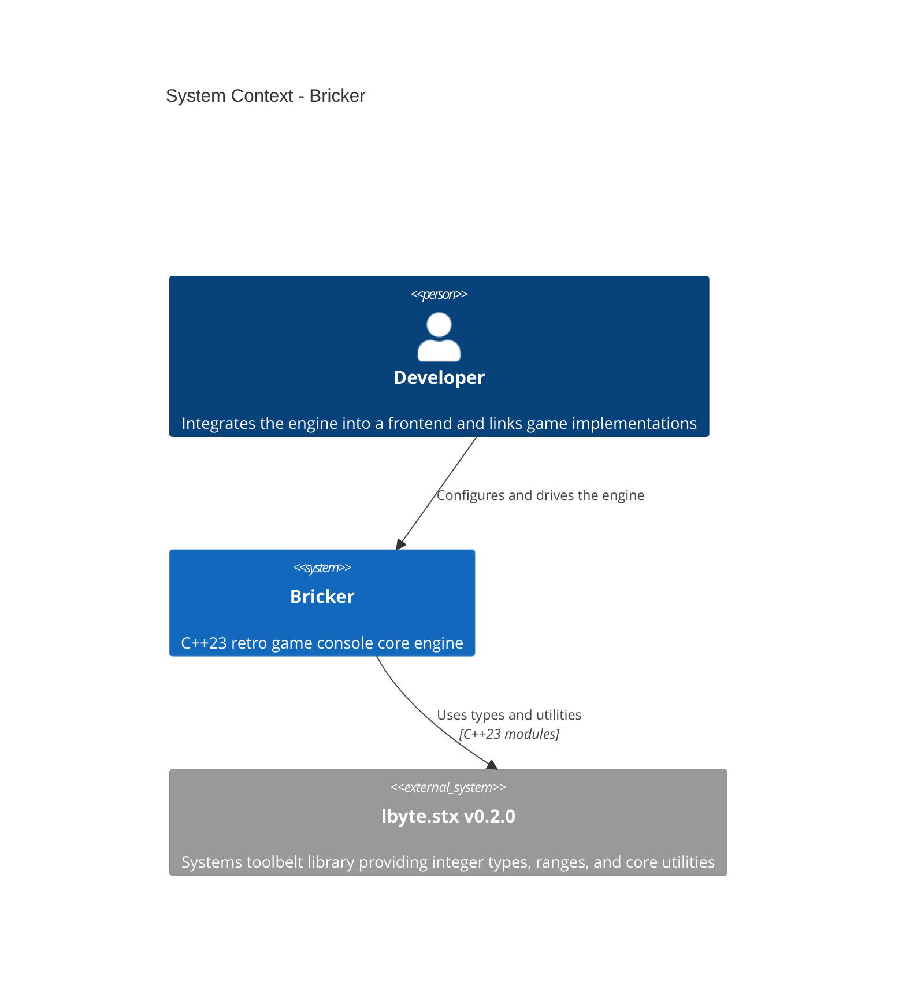
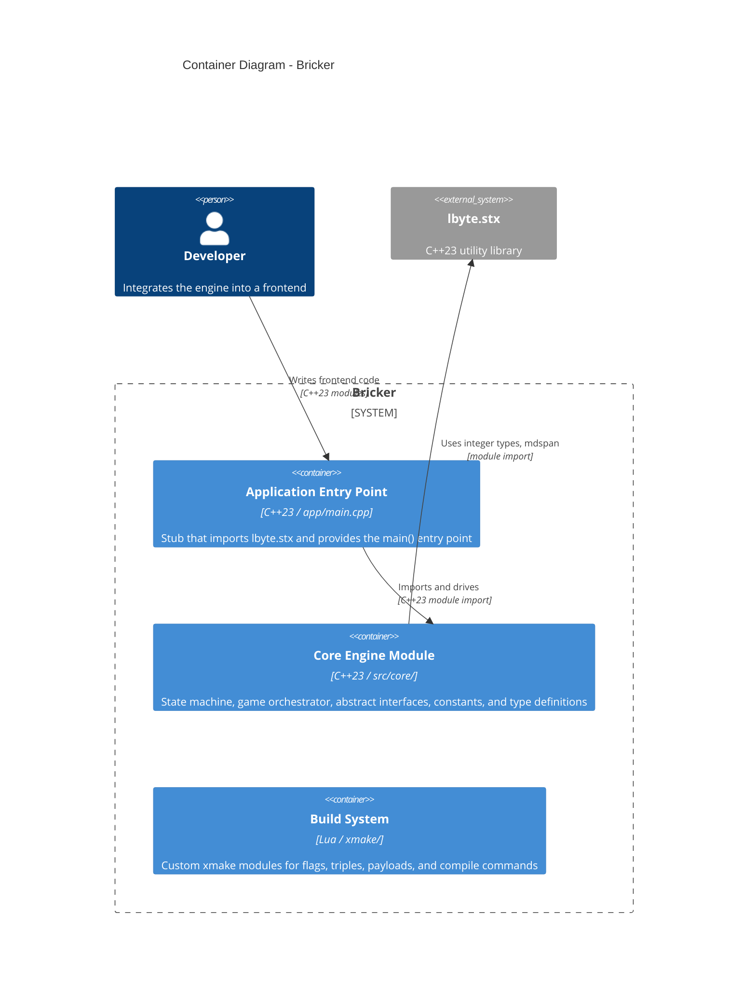
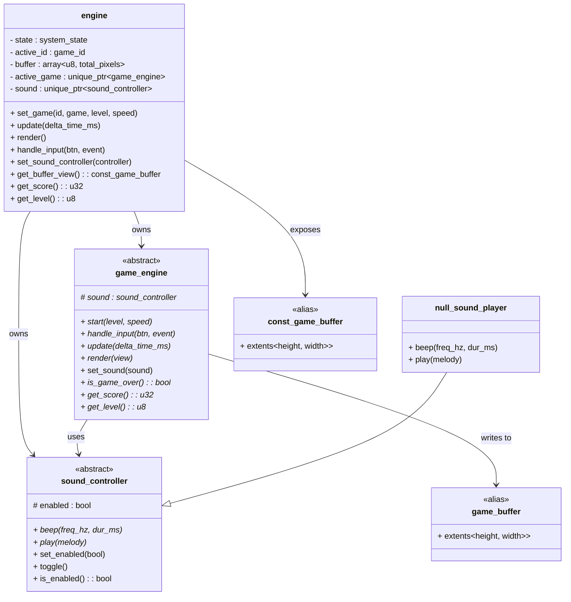
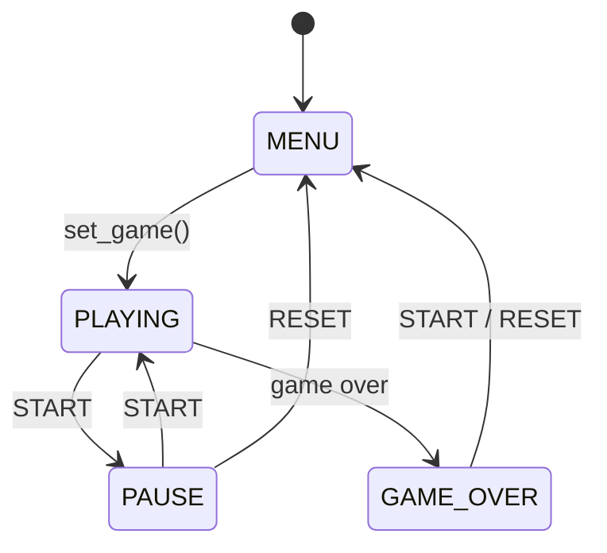

# Architecture

> **Bricker** -- System Architecture Document
> Version: 0.1.0 | Updated: 2026-07-08

---

## Table of Contents

1. [System Context](#system-context)
2. [Container Diagram](#container-diagram)
3. [Component Diagram](#component-diagram)
4. [Data Flow](#data-flow)
5. [Design Decisions](#design-decisions)
6. [Technology Stack](#technology-stack)

---

## System Context



| Element       | Description |
|---------------|-------------|
| **Developer** | A programmer who instantiates `bricker::engine`, injects game implementations, attaches a frontend, and runs the game loop. |
| **Bricker**   | The C++23 core library that defines the state machine, abstract game contract, type system, configuration constants, and sound interface. |
| **lbyte.stx** | An external header-only library providing platform-independent integer types (`u8`, `u16`, `u32`, `i32`, `usize`), `scast`, `range`, and module partitions (`lbyte.stx.core`, `lbyte.stx.range`). |

---

## Container Diagram



| Container                                    | Responsibility |
|----------------------------------------------|----------------|
| **Application Entry Point** (`app/main.cpp`) | Minimal stub that imports `lbyte.stx` and defines `main()`. Serves as the anchor for the build target; frontend code links here. |
| **Core Engine Module** (`src/core/`)         | Central orchestrator containing the state machine (`bricker::engine`), abstract game contract (`game_engine`), type definitions (`types`), configuration constants (`config`), and sound interface (`sound_controller`). |
| **Build System** (`xmake/`)                  | Lua-based xmake build configuration with custom modules for compiler flag management, target triple detection, compile commands generation, and binary payload extraction. |

---

## Component Diagram



---

## Data Flow

### Engine Lifecycle

```text
  Application                  engine                active_game
      |                          |                       |
      |  handle_input(btn,ev)    |                       |
      |------------------------->|                       |
      |                          |- state machine        |
      |                          |  dispatch             |
      |                          |                       |
      |                          |  handle_input(btn,ev) |
      |                          |---------------------->|
      |                          |                       |
      |  update(dt)              |                       |
      |------------------------->|                       |
      |                          |  update(dt)           |
      |                          |---------------------->|
      |                          |  is_game_over()       |
      |                          |<----------------------|
      |                          |                       |
      |  render()                |                       |
      |------------------------->|                       |
      |                          |  render(view)         |
      |                          |---------------------->|
      |                          |                       |
      |  get_buffer_view()       |                       |
      |<-------------------------|                       |
```

### Engine State Machine



---

## Design Decisions

### 1. C++23 Modules

**Decision:** All source files use C++20/23 named modules (`.cppm` extension) instead of traditional headers.

**Rationale:**
- Faster build times through module dependency graph optimization.
- Better encapsulation -- only exported symbols are visible to importers.
- Elimination of the preprocessor for includes, reducing macro-related bugs.
- The `core` module uses partitions (`:types`, `:config`, `:interfaces`, `:engine`) for logical separation while maintaining a single public face via `core.cppm`.

### 2. `std::mdspan` for Pixel Buffer

**Decision:** The game buffer is a flat `std::array<u8, 200>` exposed through `std::mdspan` with 2D extents (20 rows x 10 columns).

**Rationale:**
- Natural 2D indexing (`view[row, col]`) without manual offset computation.
- Const-correct access via `game_buffer` (mutable) and `const_game_buffer` (read-only) aliases.
- Zero-cost abstraction -- `mdspan` is a non-owning view with no virtual dispatch or allocation overhead.

### 3. Plugin-Based Game Architecture

**Decision:** Games implement the abstract `game_engine` interface. The `bricker::engine` holds a `unique_ptr<game_engine>` and dispatches calls polymorphically.

**Rationale:**
- New games can be added without modifying the core engine -- open/closed principle.
- Games are self-contained in their own module partitions, fully decoupled from the engine.
- The `game_id` enum provides a stable identifier scheme for game selection and routing.
- Each game manages its own state, rendering, and collision logic independently.

### 4. Abstract Sound Interface

**Decision:** Sound is abstracted behind the `sound_controller` interface with a `null_sound_player` default.

**Rationale:**
- The core engine is never coupled to any audio backend -- swap in aplay, SDL, or any other implementation.
- The null object pattern (`null_sound_player`) allows the engine to function without any audio system installed.
- Games emit sound through the interface; the engine wires the controller at injection time.

### 5. xmake Build System

**Decision:** xmake >= v2.8.0 is used with custom Lua modules for build configuration.

**Rationale:**
- First-class C++20/23 module support via `build.c++.modules` and `build.c++.modules.std` policies.
- Extensible via Lua modules: custom flag management, target triple detection, binary payload embedding.
- Cross-platform (Linux, macOS, Windows) with consistent build semantics.
- Local package repository (`xmake/packages/`) for the `lbyte.stx` dependency avoids network issues during development.

### 6. No Exceptions, No RTTI

**Decision:** The release build uses `-fno-exceptions` and `-fno-rtti`.

**Rationale:**
- Smaller binary size and reduced memory footprint.
- The engine uses a deterministic state machine where error handling is state-based, not exception-based.
- Debug builds retain exceptions and RTTI for development convenience.

---

## Technology Stack

| Layer         | Technology               | Version      | Purpose                                                      |
|---------------|--------------------------|--------------|--------------------------------------------------------------|
| Language      | C++                      | C++23        | All engine logic and interfaces                              |
| Build System  | xmake                    | >= 2.8.0     | Build orchestration, module support, dependency management   |
| Standard Lib  | C++ Standard Library     | C++23        | Memory, containers, chrono, mdspan, threading                |
| Utilities     | lbyte.stx                | v0.2.0       | Integer types (`u8`-`u64`, `i32`, `usize`), `scast`, `range` |
| Compiler      | Clang >= 21 or GCC >= 16 | --           | C++23 module support required                                |

---

*This document follows the C4 model for software architecture visualization and aligns with IEEE 1016-2009 software design documentation guidelines.*

