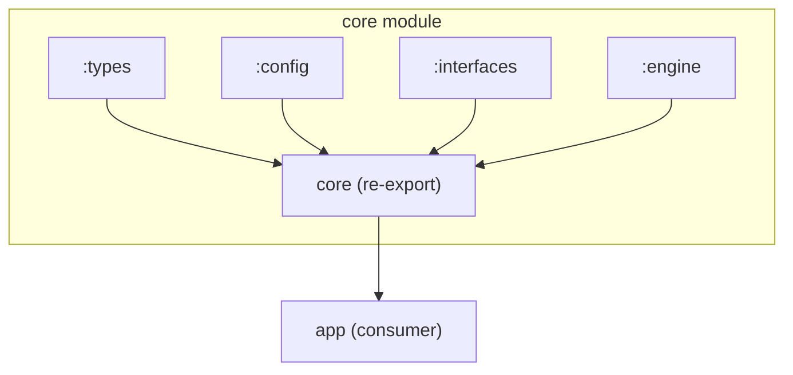
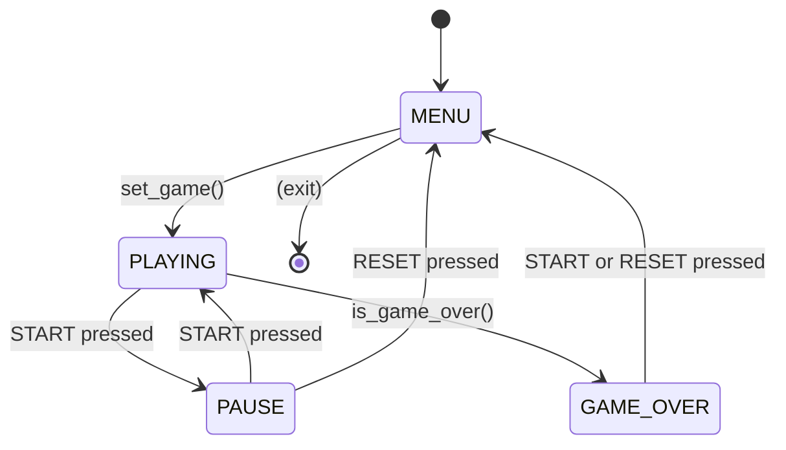
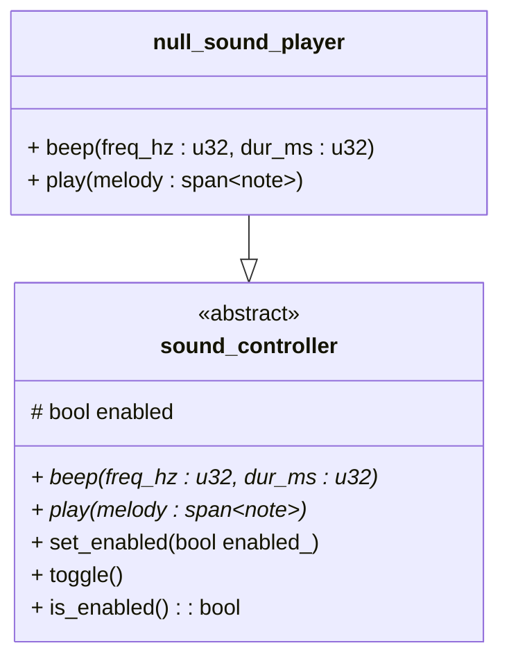
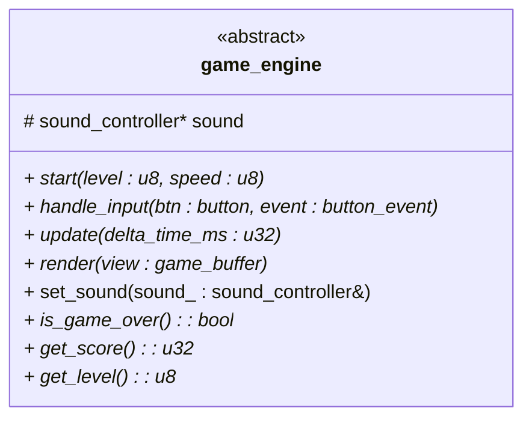
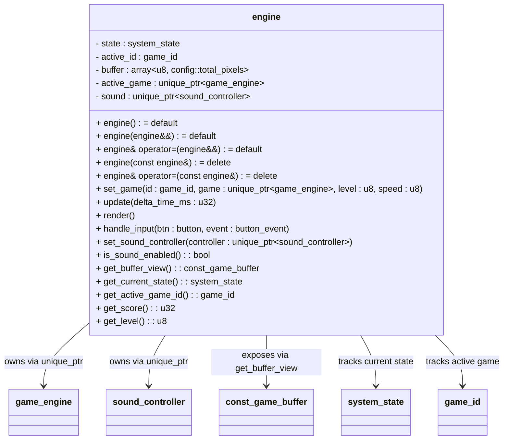
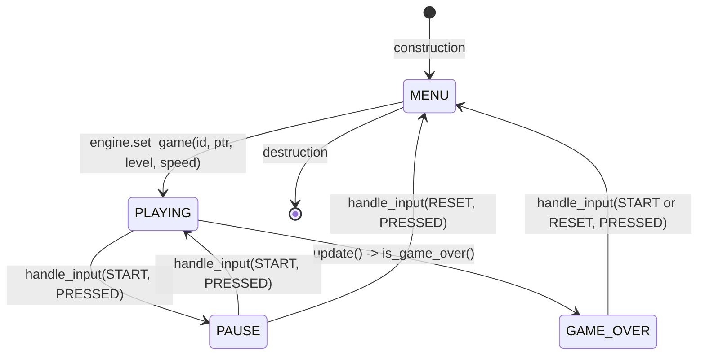
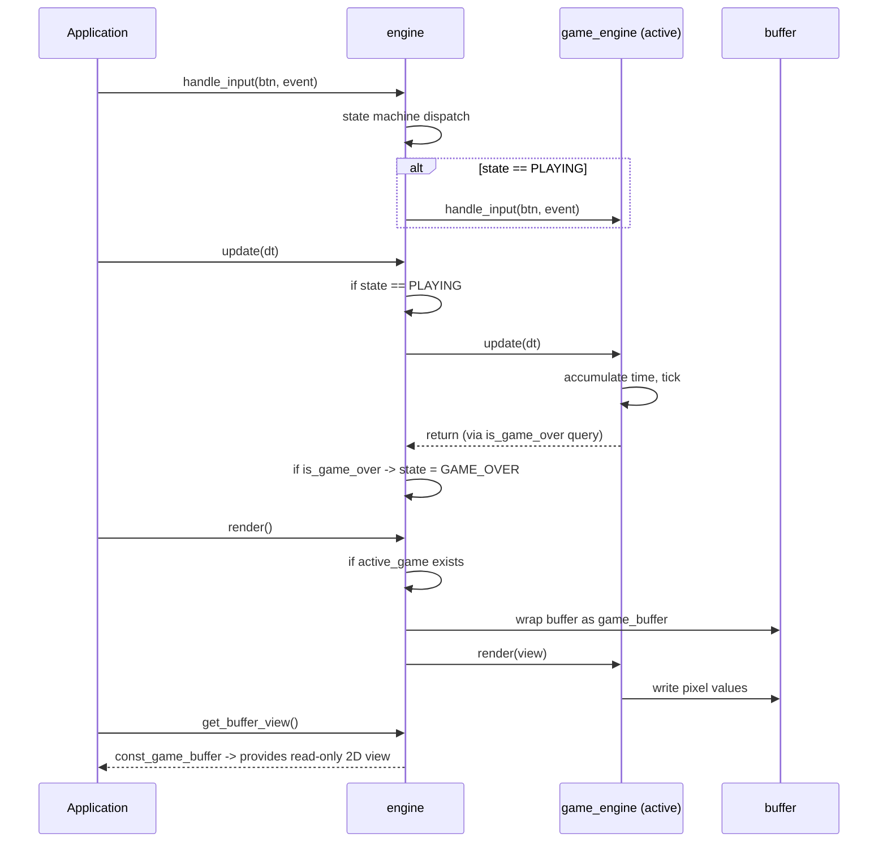

# Core Module

> **Bricker** -- Core Module Reference
> Version: 0.1.0 | Updated: 2026-07-08
> Module: `core` (partitioned: `:types`, `:config`, `:interfaces`, `:engine`)

---

## Table of Contents

1. [Overview](#overview)
2. [Module Structure](#module-structure)
3. [Types Module (`:types`)](#types-module-types)
4. [Config Module (`:config`)](#config-module-config)
5. [Interfaces Module (`:interfaces`)](#interfaces-module-interfaces)
6. [Engine Module (`:engine`)](#engine-module-engine)
7. [State Machine Reference](#state-machine-reference)

---

## Overview

The `core` module is the central nervous system of Bricker. It defines all foundational types, configuration constants, abstract contracts, and the engine orchestrator. It is partitioned into four sub-modules, all re-exported through the primary `core` module interface.



| Partition     | Dependency                                                  | Exports |
|---------------|-------------------------------------------------------------|---------|
| `:types`      | `lbyte.stx.core`                                            | Enums (`system_state`, `button`, `button_event`, `game_id`), struct (`note`) |
| `:config`     | `lbyte.stx.core`, `std`                                     | Constants (`game_width`, `game_height`, `total_pixels`, `max_speed`, `max_level`, `base_tick_ms`) |
| `:interfaces` | `:types`, `:config`, `lbyte.stx.core`, `std`                | Abstract classes (`game_engine`, `sound_controller`, `null_sound_player`), type aliases (`game_buffer`, `const_game_buffer`) |
| `:engine`     | `:interfaces`, `:types`, `:config`, `lbyte.stx.core`, `std` | `bricker::engine` class |

---

## Types Module (`:types`)

**File:** `src/core/types.cppm`
**Namespace:** `bricker`

Defines the primitive types used throughout the system.

### Enumerations

#### `system_state`



| Enumerator   | Value | Description                                                   |
|--------------|-------|---------------------------------------------------------------|
| `MENU`       | 0     | Idle state waiting for game selection                         |
| `PLAYING`    | 1     | Active gameplay -- engine updates and renders                 |
| `PAUSE`      | 2     | Game suspended -- input processing limited to START and RESET |
| `GAME_OVER`  | 3     | Game ended -- displays final score, awaits acknowledgment     |

#### `button`

| Enumerator | Value | Context          |
|-----------|-------|-------------------|
| `UP`      | 0     | In-game direction |
| `DOWN`    | 1     | In-game direction |
| `LEFT`    | 2     | In-game direction |
| `RIGHT`   | 3     | In-game direction |
| `ACTION`  | 4     | Contextual action |
| `START`   | 5     | Start/pause game  |
| `SOUND`   | 6     | Toggle audio      |
| `RESET`   | 7     | Return to menu    |

#### `button_event`

| Enumerator | Value | Description                       |
|------------|-------|-----------------------------------|
| `PRESSED`  | 0     | Key went from released to pressed |
| `RELEASED` | 1     | Key went from pressed to released |

#### `game_id`

| Enumerator | Value | Description      |
|------------|-------|------------------|
| `NONE`     | 0     | No game selected |
| `SNAKE`    | 1     | Reserved         |
| `TETRIS`   | 2     | Planned          |
| `TANKS`    | 3     | Planned          |
| `RACING`   | 4     | Planned          |
| `BREAKOUT` | 5     | Planned          |

### Data Structures

#### `note`

| Field     | Type  | Description                            |
|-----------|-------|----------------------------------------|
| `freq_hz` | `u32` | Frequency in Hertz (e.g., 440 for A4)  |
| `dur_ms`  | `u32` | Duration in milliseconds               |

Used to encode short melodies for game events (level-up, game-over).

---

## Config Module (`:config`)

**File:** `src/core/config.cppm`
**Namespace:** `bricker::config`

Centralizes all tunable game constants in a single location.

### Constants

| Constant         | Type  | Value | Description                                         |
|------------------|-------|-------|-----------------------------------------------------|
| `game_width`     | `u8`  | 10    | Pixel grid columns                                  |
| `game_height`    | `u8`  | 20    | Pixel grid rows                                     |
| `total_pixels`   | `u16` | 200   | Total cells in the buffer (`width * height`)        |
| `max_speed`      | `u8`  | 10    | Maximum game speed (used for tick rate calculation) |
| `max_level`      | `u8`  | 10    | Maximum level (caps difficulty progression)         |
| `base_tick_ms`   | `u32` | 500   | Base tick interval in milliseconds                  |

### Tick Rate Formula

```text
effective_tick_ms = base_tick_ms / speed
                   = 500 ms / speed

  speed=1  -> 500 ms/tick (slowest)
  speed=5  -> 100 ms/tick
  speed=10 -> 50 ms/tick (fastest)
```

---

## Interfaces Module (`:interfaces`)

**File:** `src/core/interfaces.cppm`
**Namespace:** `bricker`

Defines abstract contracts that decouple the engine from concrete implementations.

### Type Aliases

```cpp
using game_buffer = std::mdspan<
    u8,
    std::extents<usize, config::game_height, config::game_width>
>;

using const_game_buffer = std::mdspan<
    u8 const,
    std::extents<usize, config::game_height, config::game_width>
>;
```

The pixel buffer is a flat `std::array<u8, 200>` owned by the engine, accessed through a non-owning 2D `mdspan`. Each cell contains a pixel value interpreted by the frontend renderer:

| Pixel Value | Meaning (Convention)      |
|-------------|---------------------------|
| `0`         | Empty                     |
| `1`         | Player head / active cell |
| `2`         | Body / trail              |
| `3`         | Pickup / food             |

### `sound_controller`



| Method        | Signature                     | Description                                               |
|---------------|-------------------------------|-----------------------------------------------------------|
| `beep`        | `(freq_hz: u32, dur_ms: u32)` | Play a single tone at given frequency for given duration. |
| `play`        | `(melody: span<note>)`        | Play a sequence of notes (melody).                        |
| `toggle`      | `()`                          | Invert the enabled state.                                 |
| `is_enabled`  | `() -> bool`                  | Query whether sound is active.                            |
| `set_enabled` | `(enabled: bool)`             | Explicitly set enabled state.                             |

The `null_sound_player` is a no-op implementation used as the default controller when no audio backend is configured.

### `game_engine`



| Method         | Signature                            | Description                                          |
|----------------|--------------------------------------|------------------------------------------------------|
| `start`        | `(level: u8 = 1, speed: u8 = 1)`     | Initialize game state with difficulty parameters.    |
| `handle_input` | `(btn: button, event: button_event)` | React to player input during gameplay.               |
| `update`       | `(delta_time_ms: u32)`               | Advance game simulation by `delta_time_ms`. Should accumulate time and tick at the configured rate. |
| `render`       | `(view: game_buffer)`                | Draw the current game state into the pixel buffer.   |
| `set_sound`    | `(sound_: sound_controller&)`        | Attach a sound controller for audio feedback.        |
| `is_game_over` | `() -> bool`                         | Query whether the game has reached a terminal state. |
| `get_score`    | `() -> u32`                          | Return the current score.                            |
| `get_level`    | `() -> u8`                           | Return the current level.                            |

#### Contract Invariants

1. `start()` must be called before any `update()` or `render()` call.
2. `render()` must not modify game state -- it is a read-only snapshot operation.
3. `handle_input()` may be called during `PAUSE` state (for games that allow menu-based interaction).
4. The `sound` pointer may be `null`; implementations must guard against null dereference.

---

## Engine Module (`:engine`)

**File:** `src/core/engine.cppm`
**Namespace:** `bricker`

The `engine` class is the concrete orchestrator that owns the game state machine, the pixel buffer, and the active game instance.

### Class Diagram



### Ownership Model

```text
  +---------------------------------------------------------------+
  |                        engine                                 |
  |                                                               |
  |  unique_ptr<game_engine>       --- owns ---> game_engine      |
  |  unique_ptr<sound_controller>  --- owns ---> sound_controller |
  |  array<u8, 200> buffer                (flat pixel data)       |
  +---------------------------------------------------------------+
```

- The engine owns the game instance and sound controller via `unique_ptr`.
- The engine is movable but not copyable (deleted copy constructor/assignment).
- Games are injected via `set_game()`, enabling polymorphic behavior without compile-time coupling.

### State Machine



#### State Transition Table

| Current State | Trigger                                 | Condition              | Next State  | Side Effects |
|---------------|-----------------------------------------|------------------------|-------------|--------------|
| `MENU`        | `set_game()`                            | Always                 | `PLAYING`   | Calls `game->start()`, emits startup beep |
| `PLAYING`     | `update()`                              | `game->is_game_over()` | `GAME_OVER` | State flag set; game instance preserved |
| `PLAYING`     | `handle_input(START, PRESSED)`          | Always                 | `PAUSE`     | --                    |
| `PLAYING`     | `handle_input(SOUND, PRESSED)`          | Always                 | `PLAYING`   | `sound->toggle()`     |
| `PLAYING`     | Any input                               | Not START/SOUND        | `PLAYING`   | Delegated to `active_game->handle_input()` |
| `PAUSE`       | `handle_input(START, PRESSED)`          | Always                 | `PLAYING`   | --                    |
| `PAUSE`       | `handle_input(RESET, PRESSED)`          | Always                 | `MENU`      | `active_game.reset()` |
| `GAME_OVER`   | `handle_input(START or RESET, PRESSED)` | Always                 | `MENU`      | `active_game.reset()` |

### Game Loop Contract



---

## State Machine Reference

### `system_state` Transition Matrix

```text
                    +-------+----------+-------+-----------+
                    | MENU  | PLAYING  | PAUSE | GAME_OVER |
+-------------------+-------+----------+-------+-----------+
| set_game()        | PLAY  | --       | --    | --        |
| update() -> game  | --    | GAME_OVER| --    | --        |
|   over            |       |          |       |           |
| START (PRESSED)   | --    | PAUSE    | PLAY  | MENU      |
| RESET (PRESSED)   | --    | --       | MENU  | MENU      |
| SOUND (PRESSED)   | --    | PLAYING* | --    | --        |
| Other input       | --    | PLAYING+ | --    | --        |
+-------------------+-------+----------+-------+-----------+

  *  Sound toggled but state unchanged
  +  Delegated to active game instance
  -- No transition (input ignored)
```

---

*This document provides a declarative reference for the Bricker core module, suitable for code review, onboarding, and architectural decision records (ADR).*

